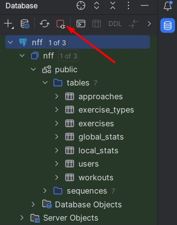

# Инструкция по развертыванию приложения

### Требования для запуска
1. PostgreSQL >= 15.5
2. Python >= 3.11

### Подготовительный этап
Все описанные ниже операции производятся в терминале из корня проекта.

1. Разворачиваем БД. Для этого:
   ```
   SET PGCLIENTENCODING=utf-8
   chcp 65001
   psql -U postgres -h localhost -f .\migrations\migrate.sql -f .\migrations\seed.sql
   ```
   Скрипт ```migrate.sql``` создает БД с именем nff и девятью таблицами. 
   Скрипт ```seed.sql``` заполняет таблицы пресетами. Для доступа к приложению создается один пользователь: `admin`:`admin`
2. Создаем файл с именем ```.env```. Его содержимое должно иметь следующую структуру:
   ```
   DB_HOST=<postgresql host>
   DB_PORT=<postgresql port>
   DB_NAME=nff
   DB_USER=<postgesql username>
   DB_PASS=<postgresql password>

   JWT_SECRET=<sha-256 hashed string>
   JWT_ALG=HS256
   TOKEN_EXPIRATION=<integer number of minutes>

   SERVER_HOST=localhost
   SERVER_PORT=8000
   ```
   По дефолту хостом является `localhost`, а портами - `5432`(для БД) и `8000`(для сервера) (смотрите ```example.env```). Хэш можно получить где-то здесь: https://emn178.github.io/online-tools/sha256.html.
3. Создаем виртуальное окружение и активируем его:
   ```
   python -m venv venv
   .\venv\Scripts\activate
   ```
   Самый важный пункт! Обязательно активируйте виртуальное окружение, чтобы иметь доступ к модулю, ответственному за сервер.

4. Устанавливаем зависимости проекта:
   ```
   pip install -r .\requirements.txt
   ```
5. Готовность номер один. Готовы к взлету.

### Запуск сервера
1. Запускаем сервер:
   ```
   python.exe -m uvicorn src.main:app --reload
   ```
2. Вы также можете добавить профиль запуска в вашей IDE. Он должен выглядеть следующим образом:
   
3. Победа!

### Заметочка для повторного развертывания
База данных может изменяться в своей структуре от версии к версии, поэтому иногда приходится ее "пересобирать".
Рекомендую перед выполнением psql-команд отключить все соединения с БД "nff".
Сделать это можно или в PgAdmin или в IDE. Например так:


